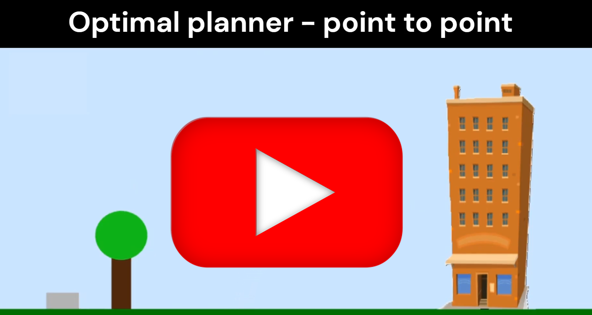

## Click to see the YouTube video

# Bicopter Control Simulation

## Project description
Bicopter control simulation using MATLAB and Simulink. Implemented an optimal controller based on a custom convex optimization solver, along with a cascade PID controller for feedback.

## Authors
- Andrea Vivai - GitHub: [https://github.com/AndreaVivai](https://github.com/AndreaVivai)
- Enea Dragoni - GitHub: [https://github.com/EneaDragoni](https://github.com/EneaDragoni)
